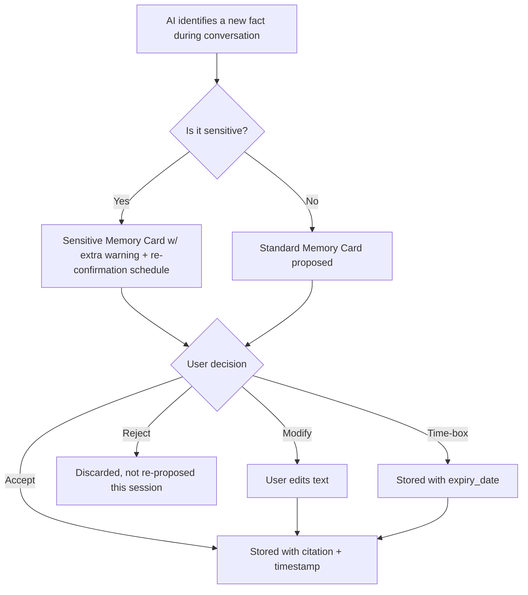
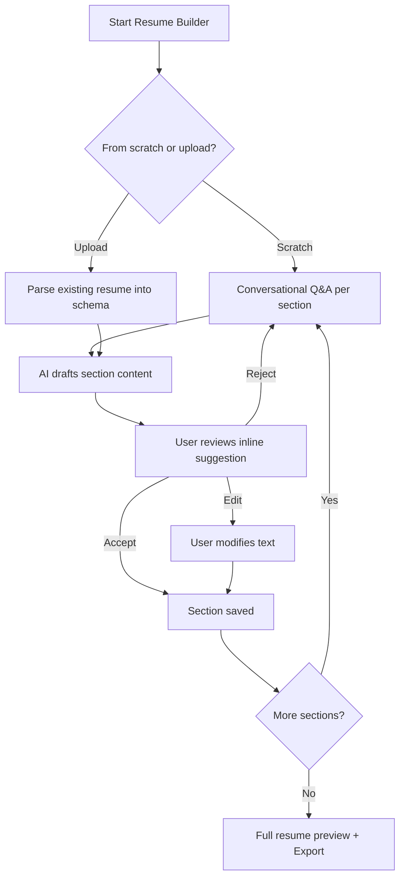
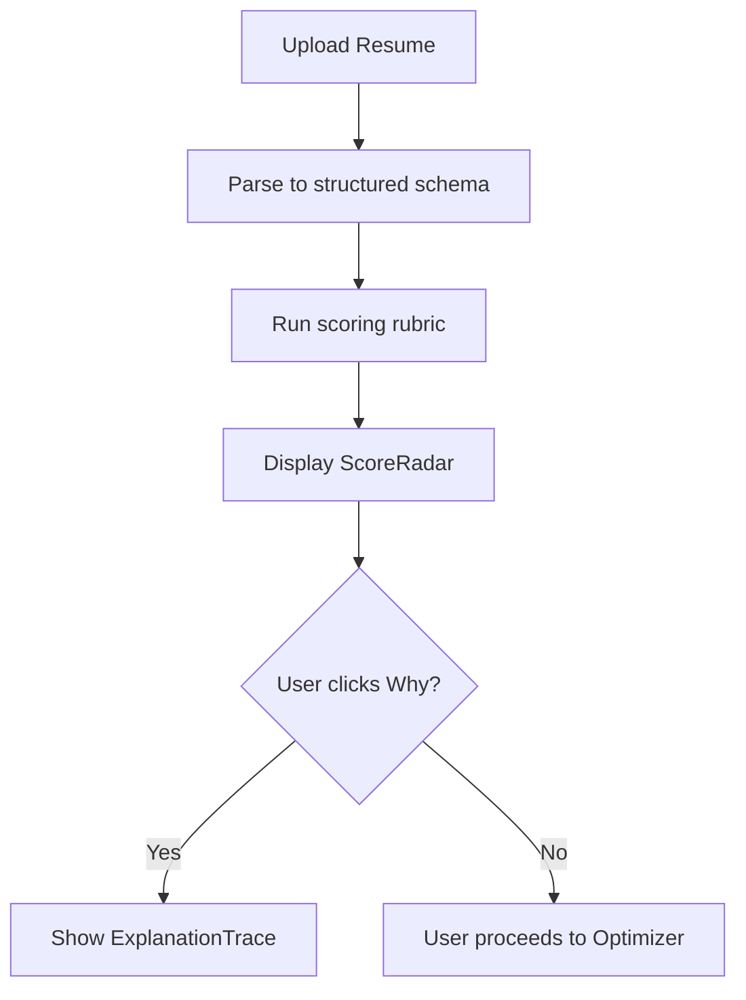
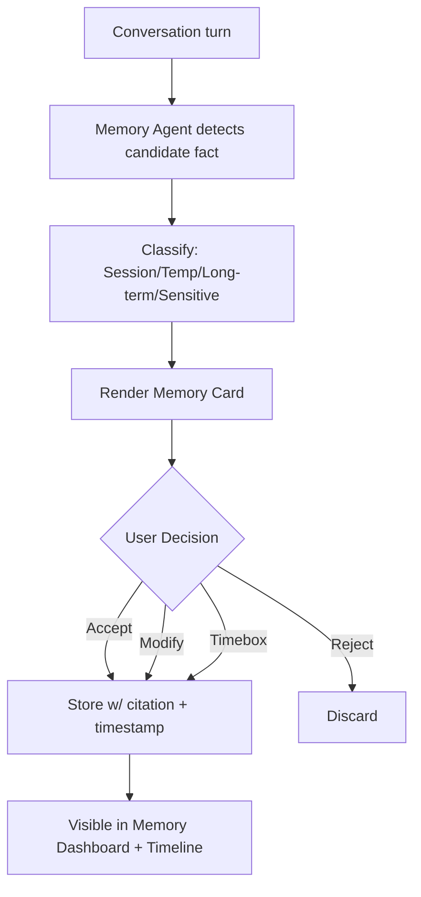
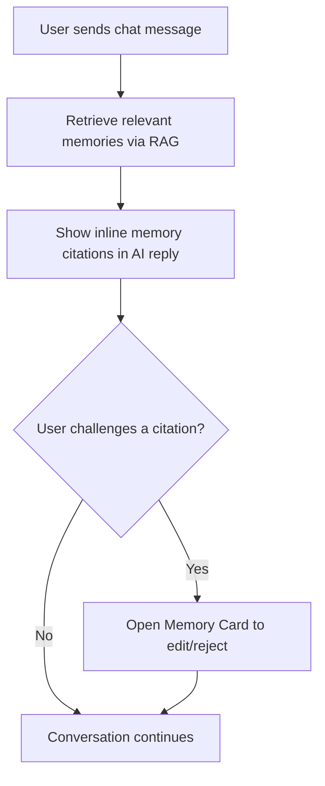
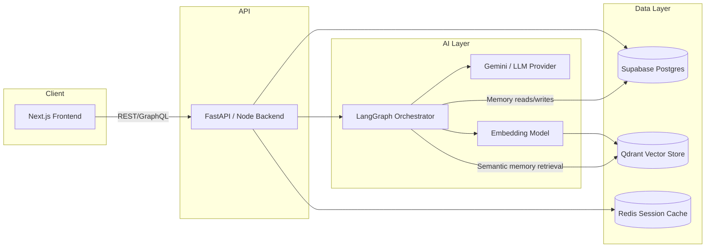
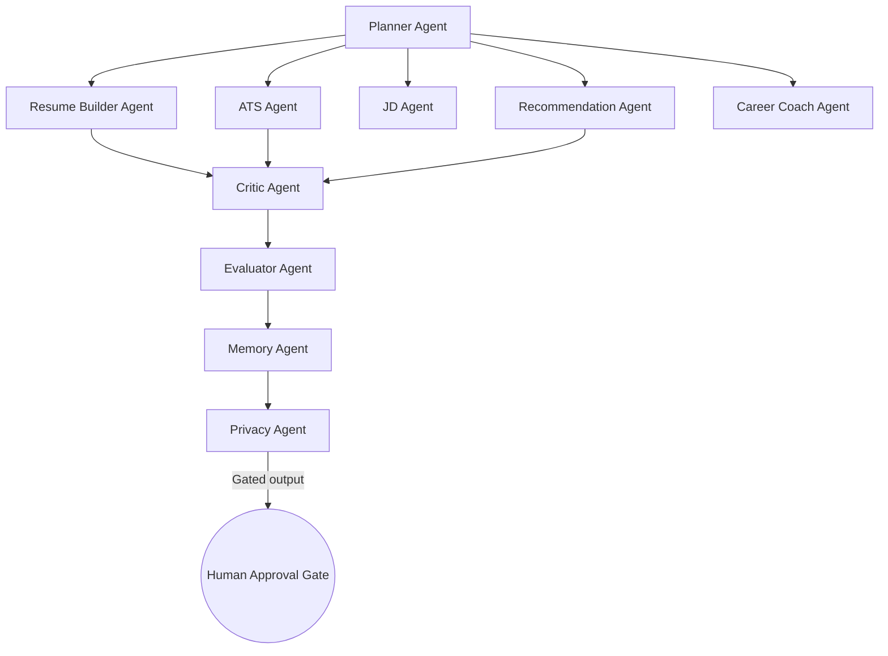

# 🧭 CareerPilot AI
### A Human-Centered AI Career Copilot That Negotiates Memory, Explains Itself, and Puts You in Control

> *"Not another resume bot. A new interaction model for how humans and AI collaborate on the most personal document of your professional life."*

**Primary Track:** PS06 — Negotiating AI Memory
**Secondary Alignment:** PS01 — Explainable AI · PS02 — Context-Aware Privacy

---

## Table of Contents

1. Executive Summary
2. Hackathon Alignment
3. User Personas
4. Current Problems
5. Our Solution
6. Core Features
7. Memory Negotiation System
8. Explainable AI System
9. Privacy System
10. Human Approval Workflow
11. Conversation Flow (Mermaid Diagrams)
12. User Journey
13. UI Pages
14. Reuse Strategy
15. Technical Architecture
16. Folder Structure
17. Database Schema
18. API Design
19. AI Agent Architecture
20. Implementation Roadmap
21. Presentation Strategy
22. Future Scope
23. Tech Stack Rationale
24. Unique Selling Points
25. README

---

# 1. Executive Summary

## Problem

Every existing AI resume tool — RoleReady, AdaptIQ, and the dozens of ChatGPT wrappers flooding the market — treats the resume as a **document to be optimized**, not as a **living record of a person's professional identity**. In doing so, they commit three sins:

1. **They remember silently.** Once you upload a resume, the AI "knows" your job history, your salary expectations, your skill gaps, your career failures — forever, with no visible ledger of what it retained, why, or for how long.
2. **They recommend opaquely.** "This resume scored 62/100" — with no reasoning, no counterfactual, no path to 90.
3. **They control nothing back to the user.** Auto-rewrites, auto-tailoring, auto-submission — the human becomes a bystander in decisions about their own career narrative.

## Vision

A career copilot where **the AI's memory is a negotiated contract, not a silent database** — where every fact the AI retains about you was offered, explained, and approved by you, and can be renegotiated at any time.

## Mission

To design and ship the reference interaction pattern for **human-negotiated AI memory** in a real, usable product — proving that transparency and control are not friction, but the foundation of trust in career-critical AI tools.

## Why Now

- LLM-powered career tools are proliferating faster than the interaction patterns needed to make them trustworthy.
- Regulatory pressure (GDPR "right to be forgotten," India's DPDP Act, EU AI Act transparency requirements) is forcing AI products to expose memory and reasoning — most products retrofit this as a settings page. We design it as the *core interaction*.
- Career data is uniquely sensitive: salary history, layoffs, gaps, health-related leave, immigration status — all of it flows through resume/JD tools today with zero negotiated consent.

## Innovation

The **Memory Negotiation System** (Section 7) — a first-class, always-visible UI layer where:
- Every new memory the AI wants to store is proposed as a **Memory Card** with an explicit rationale.
- The user can **Accept / Modify / Reject / Time-box** any memory.
- A **Memory Timeline + Graph** visualizes what the AI knows, how facts connect, and how confidence in each fact evolves.
- A one-tap **Forget Flow** lets users revoke memory retroactively, with the AI explaining what changes as a result.

## Competitive Advantage

| Dimension | ChatGPT / Generic LLM Tools | ATS Analyzers (Jobscan, etc.) | RoleReady / AdaptIQ (as-is) | CareerPilot AI |
|---|---|---|---|---|
| Memory transparency | ❌ Hidden, implicit | ❌ No persistent memory | ⚠️ Stored, not surfaced | ✅ Negotiated, visualized |
| Explainability | ⚠️ Free-text only | ⚠️ Score, no reasoning graph | ❌ Black-box scoring | ✅ Structured, cited, confidence-scored |
| Privacy control | ⚠️ Generic settings toggle | ❌ None | ❌ None | ✅ Field-level consent + redaction |
| Human approval | ❌ Auto-applies edits | N/A | ⚠️ Partial | ✅ Nothing changes without approval |
| Career-specific memory model | ❌ | ❌ | ❌ | ✅ Purpose-built taxonomy |

---

# 2. Hackathon Alignment

## Why This Fits PS06 — Negotiating AI Memory (Primary)

PS06 asks: *how should an AI system negotiate what it remembers about a user, rather than silently accumulating context?* CareerPilot AI makes this the **spine of the product**, not a bolt-on:

- Every memory write is a **proposed transaction**, never a silent side-effect.
- Users can inspect, timebox, edit, or revoke memory at the field level, at any time — not just via a blanket "clear history."
- The AI's downstream recommendations **cite which memories** they used, closing the loop between negotiation and consequence.
- We model **memory decay and expiration** as first-class concepts (a memory about "currently interviewing at Company X" should not persist forever).

## How It Partially Aligns With PS01 — Explainable AI

Every AI output that touches a user's career (resume score, matched skills, suggested rewrite) is paired with:
- A structured reasoning trace ("why this score"),
- A confidence indicator,
- An alternative path ("what would raise this score"),
- A visible source (which memory/resume section/JD line it drew from).

This isn't a separate feature — explainability is what makes memory negotiation *meaningful*: users can only decide whether to let the AI remember something once they understand how that memory will be used.

## How It Partially Aligns With PS02 — Context-Aware Privacy

- The system performs **PII/sensitive-field detection** on uploaded resumes (age, marital status, photo, health info) and proactively asks whether these should be remembered, used, or redacted — context-aware rather than a static privacy toggle.
- Privacy decisions are **scoped to context**: a memory usable for "career coaching" may be marked as *not* usable for "resume export to employer," and the user sets this distinction explicitly.

## Judging Criteria Satisfied

| Criterion | How CareerPilot AI Satisfies It |
|---|---|
| **Human-Centered Interaction Design** | Memory Negotiation UI, Human Approval Workflow — the core novelty of the product |
| **Novelty of Interaction Pattern** | Memory Cards, Memory Graph, Forget Flow — not seen in existing resume tools |
| **Technical Feasibility** | Built on existing RoleReady + AdaptIQ codebases; realistic hackathon-scoped architecture |
| **Explainability** | Dedicated Explainability Screen, reasoning traces on every AI output |
| **Privacy & Trust** | Field-level consent, redaction engine, privacy dashboard |
| **Real-World Applicability** | Directly extends two existing real repos into a mergeable, shippable product |
| **Presentation Clarity** | Full pitch story, demo flow, and anticipated judge Q&A included (Section 21) |

---

# 3. User Personas

### 🎓 Persona 1 — The College Student ("Ananya, 20, CS Junior")
- **Goals:** Build her first real resume; understand what recruiters look for; land an internship.
- **Pain Points:** No professional experience to describe; doesn't know ATS keywords exist; overwhelmed by generic advice.
- **Needs:** Guided resume building from scratch; project/skill translation into resume language.
- **AI Expectations:** Wants heavy hand-holding but is nervous about AI "making things up" about her.
- **Privacy Concerns:** Doesn't want her college project code or personal email spread across future recruiter-facing exports without knowing.

### 💼 Persona 2 — The Fresher ("Rohan, 22, Recent Graduate")
- **Goals:** Convert internship experience into a strong first professional resume; pass ATS filters.
- **Pain Points:** Doesn't know if his resume "counts" as strong; applies to 100+ jobs with no feedback loop.
- **Needs:** JD-matching, quantified impact statements, fast iteration across many job applications.
- **AI Expectations:** Wants explanations for low match scores, not just a number.
- **Privacy Concerns:** Worried that AI-stored notes about "rejected by Company X" could resurface awkwardly later.

### 🧑‍💻 Persona 3 — The Experienced Professional ("Meera, 34, Senior Engineer")
- **Goals:** Tailor an already-strong resume to specific senior roles; negotiate salary intelligently.
- **Pain Points:** Doesn't want to repeat her whole history every session; wants nuance, not generic buzzwords.
- **Needs:** Persistent long-term career memory (skills, achievements) that saves her repetitive input — but under her control.
- **AI Expectations:** High trust bar — wants to see *why* the AI suggests a change, and reject bad suggestions confidently.
- **Privacy Concerns:** Salary history and layoff history are highly sensitive; wants explicit control over what's remembered indefinitely vs. session-only.

### 🔄 Persona 4 — The Career Switcher ("Farhan, 29, Marketing → Data Analytics")
- **Goals:** Reframe unrelated experience into transferable-skill narrative for a new field.
- **Pain Points:** Existing ATS tools penalize his resume for "irrelevant" keywords; feels invisible to recruiters.
- **Needs:** Skill-gap analysis with a learning roadmap; long-term memory of his transition goal across many sessions.
- **AI Expectations:** Wants the AI to remember his transition narrative *consistently* across sessions, without re-explaining it.
- **Privacy Concerns:** Doesn't want his employer-facing resume to reveal that he's job-hunting for a pivot while still employed.

### 🧑‍💼 Persona 5 — The Recruiter ("Priya, 31, Talent Acquisition Lead")
- **Goals:** Quickly assess candidate-JD fit; reduce screening time.
- **Pain Points:** Candidate resumes are inconsistent in format and depth; hard to compare fairly.
- **Needs:** Explainable match scores she can defend to hiring managers; confidence in candidate-provided data.
- **AI Expectations:** Wants transparent scoring she can trust and cite, not a black-box number.
- **Privacy Concerns:** Needs assurance that candidate data used for matching was consensually provided and is compliantly stored.

---

# 4. Current Problems

1. Resume scores are given with no explanation of methodology.
2. AI tools silently retain uploaded resumes indefinitely with no visible retention policy.
3. Users cannot see what personal data the AI has inferred vs. what was explicitly stated.
4. No way to revoke a specific memory — only "delete my account" nuclear options.
5. ATS scoring algorithms are treated as trade secrets, eroding user trust.
6. AI resume rewrites are applied automatically, overwriting user's original voice.
7. No distinction between session-only context and long-term profile memory.
8. Sensitive fields (age, marital status, photo, health gaps) are processed without flagging.
9. No confidence indicators on AI-generated skill or keyword suggestions.
10. Career chat assistants don't remember prior conversations coherently across sessions.
11. No audit trail of what the AI used to generate a particular recommendation.
12. Users can't export their own data in a portable, understandable format.
13. Resume-JD matching gives a single score with no breakdown by skill category.
14. No way to compare multiple resume versions side by side.
15. AI tools assume every user wants maximal personalization — there's no opt-out granularity.
16. Career advice is generic, not adapted to persona (student vs. senior professional).
17. No mechanism to tell the AI "forget that I mentioned being laid off."
18. Existing tools conflate "analysis" and "storage" — you can't get feedback without the tool keeping your data.
19. No visual explanation of *why* a keyword is missing (context, not just presence/absence).
20. Learning roadmaps recommended by AI tools rarely link back to the specific skill gap that triggered them.
21. Resume builders don't support incremental, negotiated profile-building — they demand everything upfront.
22. No mechanism for time-boxed memory (e.g., "remember this only until I finish this application cycle").
23. Trust erosion: users assume AI resume tools "make things up," with no way to verify sourcing.

---

# 5. Our Solution

CareerPilot AI merges **RoleReady** (resume/JD analysis engine) and **AdaptIQ** (conversational career assistant) into one product, but the merge is not the innovation — the **interaction layer wrapped around both** is.

### What Makes This Human-Centered
Every AI action is framed as a **proposal**, not an execution. The interface treats the user as the final authority over their own career narrative — the AI drafts, explains, and waits.

### What Makes This Explainable
No score, match, or suggestion appears without an accompanying "Why?" affordance that opens a structured reasoning trace, confidence level, and cited source (resume section, JD line, or memory).

### What Makes This Privacy-First
Memory is opt-in, field-level, purpose-scoped, and time-boxed by default. Sensitive-data detection runs proactively, not reactively.

### What Makes This Different From ChatGPT
ChatGPT-based tools have ephemeral or opaque memory with no negotiation UI, no explainability layer, and no domain-specific memory taxonomy for careers.

### What Makes This Different From ATS Analyzers
ATS analyzers are single-purpose scoring engines with no conversational layer, no memory, and no explainability beyond a percentage.

---

# 6. Core Features

> Format: Purpose → Problem Solved → User Flow → Backend Logic → Frontend Components → AI Components → Future Scope

### 6.1 Resume Builder
- **Purpose:** Guided, conversational construction of a resume from scratch or existing draft.
- **Problem Solved:** #1 (students with no resume), #21 (upfront-heavy builders).
- **User Flow:** Start → choose "from scratch" or "upload" → conversational Q&A fills sections incrementally → live preview updates → each AI-suggested phrase requires explicit accept.
- **Backend Logic:** Section-wise draft object in Postgres; each field versioned; draft merged only on explicit save.
- **Frontend Components:** `<ResumeCanvas>`, `<SectionEditor>`, `<AIWhisperBubble>` (inline suggestion chip).
- **AI Components:** Resume Builder Agent (Section 19) using structured prompting per section.
- **Future Scope:** Multi-resume templates per target role; voice-driven building.

### 6.2 Resume Analyzer
- **Purpose:** Score and diagnose an existing resume.
- **Problem Solved:** #1, #9, #13.
- **User Flow:** Upload → parse → score breakdown by category (impact, clarity, ATS-compatibility, keyword density) → drill into any category for explanation.
- **Backend Logic:** Parsing via `pdf-parse`/`docx` extraction → structured JSON resume schema → scoring rubric applied per category.
- **Frontend Components:** `<ScoreRadar>`, `<CategoryBreakdown>`, `<WhyThisScore>` drawer.
- **AI Components:** ATS Agent + Critic Agent cross-validate scores.
- **Future Scope:** Industry-specific scoring rubrics.

### 6.3 JD Analyzer
- **Purpose:** Extract structured requirements from a pasted/uploaded job description.
- **Problem Solved:** #13, #19.
- **User Flow:** Paste JD → AI extracts must-have vs. nice-to-have skills, seniority signals, keywords → user confirms/edits extracted structure.
- **Backend Logic:** JD → LLM structured extraction → stored as `job_descriptions` row with JSONB skill taxonomy.
- **Frontend Components:** `<JDBreakdown>`, `<SkillChipEditor>`.
- **AI Components:** JD Agent.
- **Future Scope:** JD trend analysis across saved JDs ("skills you're seeing most often").

### 6.4 Resume-JD Matching
- **Purpose:** Score fit between a specific resume and JD.
- **Problem Solved:** #13, #9.
- **User Flow:** Select resume + JD → match score with category breakdown → per-skill match/gap chips → "why" on every chip.
- **Backend Logic:** Embedding similarity (resume sections vs. JD requirements) + rule-based keyword coverage, combined into weighted score.
- **Frontend Components:** `<MatchScoreCard>`, `<SkillGapGrid>`.
- **AI Components:** Recommendation Agent.
- **Future Scope:** Multi-JD batch matching dashboard.

### 6.5 Resume Optimizer
- **Purpose:** Suggest specific, approvable edits to raise match/ATS score.
- **Problem Solved:** #6, #10.
- **User Flow:** From analyzer/matcher → "Suggest Improvements" → list of diff-style suggestions → accept/reject each individually → nothing auto-applies.
- **Backend Logic:** Suggestion objects stored with `status: pending/accepted/rejected`, diff applied only on accept.
- **Frontend Components:** `<SuggestionDiffCard>`, `<BulkApprovalBar>`.
- **AI Components:** Recommendation Agent + Critic Agent.
- **Future Scope:** Tone/style presets (concise, achievement-driven, executive).

### 6.6 Career Chat (Conversational Assistant)
- **Purpose:** Open-ended career guidance conversation.
- **Problem Solved:** #10, #16.
- **User Flow:** Chat interface → AI references relevant memories (shown as inline citations) → user can challenge/correct any referenced memory in place.
- **Backend Logic:** RAG over Memory Store + conversation history in Redis (session) and Postgres (persisted).
- **Frontend Components:** `<ChatThread>`, `<MemoryCitationChip>`.
- **AI Components:** Career Coach Agent, Memory Agent.
- **Future Scope:** Multi-modal (voice) career coaching.

### 6.7 Learning Roadmap
- **Purpose:** Convert identified skill gaps into a structured learning plan.
- **Problem Solved:** #20.
- **User Flow:** From skill gap chip → "Build Roadmap" → AI proposes ordered milestones linked to the originating gap → user reorders/removes.
- **Backend Logic:** Roadmap stored as ordered list linked via foreign key to originating `skill_gap_id`.
- **Frontend Components:** `<RoadmapTimeline>`.
- **AI Components:** Recommendation Agent.
- **Future Scope:** Integration with course platforms (Coursera/Udemy API).

### 6.8 Export
- **Purpose:** Export resume as PDF/DOCX, and export user data (GDPR-style).
- **Problem Solved:** #12.
- **User Flow:** Export resume → choose template → choose which memory-derived content to include/exclude → download.
- **Backend Logic:** Template rendering engine (docx/PDF generation).
- **Frontend Components:** `<ExportModal>`, `<TemplatePicker>`.
- **AI Components:** None (deterministic rendering, by design — no AI in the final output step).
- **Future Scope:** LinkedIn-optimized export format.

### 6.9 Version History
- **Purpose:** Track resume changes over time.
- **Problem Solved:** #14.
- **User Flow:** Every save creates a version → timeline view → restore any version.
- **Backend Logic:** `resume_versions` table, append-only.
- **Frontend Components:** `<VersionTimeline>`.
- **AI Components:** Optional AI-generated version diff summary.
- **Future Scope:** Branching (like git) for parallel resume variants per role type.

### 6.10 Resume Comparison
- **Purpose:** Side-by-side comparison of two resume versions or two tailored variants.
- **Problem Solved:** #14.
- **User Flow:** Select two versions → split view with diff highlighting → score comparison.
- **Backend Logic:** Diff computed server-side on structured JSON resume schema.
- **Frontend Components:** `<SplitDiffView>`.
- **AI Components:** Optional AI commentary on which version fits which JD better.
- **Future Scope:** A/B application outcome tracking (which version got more callbacks).

---

# 7. Memory Negotiation System

> **This is the heart of CareerPilot AI.** Nothing the AI remembers about a user is stored without an explicit, explained, revocable negotiation.

## 7.1 Memory Types

| Type | Description | Default Lifespan | Example |
|---|---|---|---|
| **Session Memory** | Exists only within current chat/task session | Ends on session close | "User is currently editing the Experience section" |
| **Temporary Memory** | Persists briefly across sessions for an active task | 7–30 days, user-adjustable | "User is applying to Company X, JD attached" |
| **Long-Term Memory** | Persists indefinitely until revoked | Until user revokes | "User's core skill set: Python, SQL, React" |
| **Career Memory** | Structured facts about career trajectory | Long-term by default | "User transitioned from Marketing to Data Analytics in 2024" |
| **Sensitive Memory** | Flagged PII / high-sensitivity facts | Requires explicit re-confirmation every 90 days | "User was laid off in March 2025" |
| **Hidden Memory** | AI-inferred (not explicitly stated) facts, always shown before use | Never persisted without confirmation | "User may be underselling leadership experience" (inferred pattern) |

**Key rule:** *Hidden Memory can never silently become Long-Term Memory.* Every inference the AI makes about the user must surface as a proposed Memory Card before it is stored or used again.

## 7.2 Memory Cards

The atomic unit of negotiation. Every proposed memory renders as a card with:

```
┌─────────────────────────────────────────────┐
│ 🧠 New Memory Proposed                        │
│                                               │
│ "You mentioned leading a 5-person team       │
│  during the Company X project."              │
│                                               │
│ Category: Career Memory → Leadership          │
│ Confidence: 92%  (explicit statement)         │
│ Why I want to remember this:                  │
│  → To suggest leadership-focused phrasing     │
│    in future resume drafts.                   │
│                                               │
│ [ Accept ]  [ Modify ]  [ Reject ]            │
│ [ Remember only for this session ▾ ]          │
└─────────────────────────────────────────────┘
```

- **Accept:** stored as proposed, with source citation.
- **Modify:** user edits the exact text before storing (correcting AI's phrasing/inference).
- **Reject:** discarded immediately, never re-proposed identically in-session.
- **Time-box dropdown:** session-only / 30 days / 90 days / long-term.

## 7.3 Memory Timeline

A chronological, filterable feed of every memory event: proposed, accepted, modified, rejected, expired, forgotten. Each entry is clickable to see the originating conversation turn.

## 7.4 Memory Dashboard

Central hub (Section 13.7) organized by category (Skills, Experience, Goals, Sensitive, Inferred) showing:
- Total active memories per category
- Expiring-soon memories (highlighted, with renew/let-expire actions)
- A **"Used In"** panel per memory showing which AI outputs relied on it — closing the transparency loop.

## 7.5 Memory Graph

A node-link visualization (D3-based) where:
- Nodes = individual memories
- Edges = inferred relationships ("Leadership experience" → connects to → "Suggested for Senior role suggestions")
- Node size = confidence; node color = memory type; clicking a node opens its Memory Card detail.

This lets power users (Meera, Farhan) see at a glance *how* the AI's understanding of them is structured — not just a flat list.

## 7.6 Memory Confidence

Every memory carries a confidence score:
- **Explicit (90–100%):** User directly stated it.
- **Confirmed Inference (70–89%):** AI inferred it, user confirmed via Memory Card.
- **Unconfirmed Inference (<70%):** Never stored — only usable transiently within a single response, always disclosed inline ("This is a guess, not something I've saved").

## 7.7 Consent Flow



## 7.8 Forget Flow

```mermaid
flowchart TD
    A[User opens Memory Dashboard] --> B[Selects a memory to forget]
    B --> C[AI shows impact preview: "This memory was used in 3 past suggestions"]
    C --> D{Confirm forget?}
    D -- Yes --> E[Memory soft-deleted, removed from active context]
    E --> F[AI confirms: "Forgotten. Future suggestions won't reference this."]
    D -- No --> G[Cancel, memory retained]
```

Soft-delete (not hard-delete) for 30 days enables undo, then permanent purge — communicated clearly to the user.

## 7.9 Memory Expiration & Notifications

- Temporary/Sensitive memories notify the user 3 days before expiry: *"I'll forget that you're targeting a Data role at Company X in 3 days unless you tell me to keep it."*
- One-tap **Renew** or **Let Expire**.
- Expired memories move to an archived, read-only "Expired" tab — never silently deleted without a trace, but no longer used in reasoning.

## 7.10 Memory Categories (Taxonomy)

```
Career Memory
 ├─ Skills (technical, soft, tools)
 ├─ Experience (roles, achievements, leadership)
 ├─ Goals (target roles, industries, timelines)
 ├─ Preferences (tone, resume style, salary range)
 └─ Constraints (location, visa status, availability)

Sensitive Memory
 ├─ Employment gaps / reasons
 ├─ Compensation history
 ├─ Health-related leave
 └─ Demographic data (age, marital status if present in uploads)

Session Memory
 └─ Current task context (which resume/JD is active)
```

## 7.11 Memory Suggestions

The AI can proactively suggest *what to remember* based on patterns (e.g., "You've mentioned Python in 3 different chats — want me to save this as a core skill?") — but this suggestion is itself a Memory Card, never an automatic write.

---

# 8. Explainable AI System

Every AI output in CareerPilot AI carries a **"Why?"** affordance that opens a structured `ExplanationTrace`:

```json
{
  "output": "Resume Score: 78/100",
  "reasoning": [
    { "factor": "Quantified impact statements", "weight": 0.3, "score": 0.9, "evidence": "3 of 4 bullets contain metrics" },
    { "factor": "ATS keyword coverage", "weight": 0.25, "score": 0.6, "evidence": "Missing: 'stakeholder management', 'CI/CD'" },
    { "factor": "Clarity & conciseness", "weight": 0.2, "score": 0.85, "evidence": "Avg bullet length: 18 words" },
    { "factor": "Formatting compatibility", "weight": 0.25, "score": 0.7, "evidence": "Tables detected in Skills section may break ATS parsing" }
  ],
  "confidence": 0.88,
  "alternatives": ["Score could reach 90 by adding 2 missing keywords + removing table formatting"],
  "sources": ["resume.experience[2]", "jd.requirements[5,7]"]
}
```

### What Gets Explained
- **Resume score** → weighted rubric breakdown (above).
- **Skill recommendations** → "Recommended because 4/5 similar JDs you've matched against required this skill."
- **Keyword recommendations** → highlighted JD sentence that triggered it.
- **Missing skills** → shown as gap chips linking to the exact JD requirement line.
- **Confidence** → always shown as a percentage + qualitative label (High/Medium/Low).
- **Reasoning** → collapsible structured trace (never a wall of prose).
- **Alternatives** → "what would change the outcome" always included.
- **Sources** → every claim traces to a resume section, JD line, or Memory Card ID.
- **Trust Score** → a per-session meta-metric showing how often the user has accepted vs. rejected AI suggestions, visible to the user as *their own* trust calibration tool, not a score used against them.

### Visualizations
- `<ScoreRadar>` — category breakdown radar chart.
- `<ReasoningTrace>` — expandable factor list with weights.
- `<ConfidenceBadge>` — inline colored badge (green/amber/red).
- `<SourceHighlighter>` — hovering an explanation highlights the exact resume/JD text it references.

---

# 9. Privacy System

## Consent
Granular, purpose-scoped consent captured at the point of relevance (not a single onboarding checkbox):
- "Use this data for resume scoring" ✅
- "Use this data for career chat memory" ⬜
- "Include this in exported resume" ✅

## Storage & Encryption
- All resume/JD content encrypted at rest (AES-256) in Supabase.
- Sensitive Memory fields additionally encrypted with a per-user key, decrypted only in-session.
- No raw resume text sent to third-party AI APIs without redaction pass (see below).

## Sensitive Information Detection
An NER + rule-based pipeline scans uploaded resumes for:
- Age, date of birth, marital status, photo, nationality, religion (fields that shouldn't influence ATS scoring and pose bias risk).
- On detection, a **Privacy Prompt** appears: *"We found a photo and date of birth. These aren't recommended on modern resumes and won't be used in scoring. Redact from export?"*

## Resume Redaction
One-click redaction that removes flagged PII fields from a specific export, without touching the underlying stored resume — reversible, non-destructive.

## PII Detection & Delete/Export Data
- `Privacy Dashboard` lists every category of stored data with a per-category **Export (JSON/CSV)** and **Delete** button.
- Deletion follows the same soft-delete-then-purge pattern as Memory Forget Flow, applied uniformly for consistency.

## Data Retention
Default retention policy shown in plain language per data type (e.g., "Resumes: kept until you delete them. Chat sessions: 90 days unless saved as Long-Term Memory.").

## Privacy Dashboard
Single screen unifying: consent toggles, sensitive-field flags, redaction controls, export, and delete — cross-linked with the Memory Dashboard so privacy and memory feel like one coherent system, not two disconnected settings pages.

---

# 10. Human Approval Workflow

**Core rule: nothing changes automatically.** Every AI action that modifies user data requires explicit approval.

| AI Action | Approval Mechanism |
|---|---|
| Resume text edit | Diff card, accept/reject per suggestion |
| New memory stored | Memory Card, accept/modify/reject |
| Sensitive memory re-confirmation | Explicit re-confirm every 90 days |
| Resume export | User selects template + reviews redaction before download |
| Skill added to profile | Suggested as chip, tap to confirm |
| Learning roadmap milestone | User can reorder/remove before "starting" |
| Memory used in a new context (e.g., chat memory used in export) | Cross-context use requires a fresh consent prompt if not already scoped for that purpose |

Bulk approval is available (e.g., "Accept all suggestions") but requires an explicit second tap confirming the count of changes about to be applied — preventing accidental mass changes.

---

# 11. Conversation Flow (Mermaid Diagrams)

### 11.1 Resume Builder Flow


### 11.2 Resume Analyzer Flow


### 11.3 Memory Negotiation Flow


### 11.4 Career Assistant Flow


---

# 12. User Journey

1. **Landing** — value prop framed around control & transparency, not "AI magic." CTA: "See how CareerPilot remembers you."
2. **Signup** — minimal fields; privacy-first framing ("We'll ask before we remember anything").
3. **Resume** — upload or build; parsed into structured schema; no memory stored yet — this is Session Memory only.
4. **JD** — paste target JD; extracted requirements shown for confirmation.
5. **Matching** — score + gap breakdown; user starts seeing "Why?" affordances.
6. **Suggestions** — Optimizer proposes edits; user accepts/rejects individually.
7. **Memory** — first Memory Card appears organically during chat ("Want me to remember your target role?") — this is the "aha" moment of the product.
8. **Export** — redaction review, template choice, download.
9. **Future Sessions** — returning user sees Memory Dashboard summary on login ("Here's what I remember about you") before anything else — re-establishing control at the start of every session, not just the first.

---

# 13. UI Pages

### 13.1 Landing
- **Purpose:** Convert visitors; establish trust-first positioning.
- **Components:** Hero, "How Memory Works" explainer strip, testimonials.
- **Interactions:** Scroll-triggered animation of a sample Memory Card negotiation.

### 13.2 Dashboard
- **Purpose:** Home base after login.
- **Components:** Resume list, active JD matches, Memory Dashboard summary widget.
- **Interactions:** Quick actions (New Resume, Analyze, Chat).

### 13.3 Resume Builder
- **Purpose:** Guided resume creation. **Components:** `<ResumeCanvas>`, `<SectionEditor>`, live preview pane. **Interactions:** Inline accept/edit/reject suggestion chips.

### 13.4 Resume Viewer
- **Purpose:** Read-only formatted view + score overlay. **Components:** `<ScoreRadar>`, section-level annotations. **Interactions:** Click any section to see contributing explanation.

### 13.5 JD Viewer
- **Purpose:** Structured JD breakdown. **Components:** `<SkillChipEditor>`, must-have/nice-to-have toggle. **Interactions:** Edit extracted skills before matching.

### 13.6 AI Suggestions
- **Purpose:** Central review queue for all pending AI proposals (edits + memory). **Components:** `<SuggestionDiffCard>`, `<BulkApprovalBar>`. **Interactions:** Approve/reject individually or in reviewed batches.

### 13.7 Memory Dashboard
- **Purpose:** Full visibility/control over AI memory. **Components:** `<MemoryTimeline>`, `<MemoryGraph>`, category filters, expiring-soon panel. **Interactions:** Forget, renew, edit, inspect "Used In."

### 13.8 Privacy Dashboard
- **Purpose:** Consent, redaction, export, delete. **Components:** Per-category consent toggles, `<RedactionPreview>`. **Interactions:** One-click export/delete per category.

### 13.9 Explainability Screen
- **Purpose:** Deep-dive reasoning view. **Components:** `<ReasoningTrace>`, `<SourceHighlighter>`. **Interactions:** Hover-to-highlight source text.

### 13.10 Career Assistant
- **Purpose:** Conversational guidance. **Components:** `<ChatThread>`, `<MemoryCitationChip>`. **Interactions:** Click citation to open/edit underlying memory.

### 13.11 Profile
- **Purpose:** Structured view of confirmed Career Memory (skills, goals, experience summary). **Components:** Editable profile cards sourced directly from Long-Term Memory. **Interactions:** Any edit here writes back to the Memory Store transparently.

### 13.12 Settings
- **Purpose:** Account, notification preferences, default memory timeboxing preference. **Components:** Standard settings form. **Interactions:** Sets defaults, doesn't override per-memory choices already made.

---

# 14. Reuse Strategy

| Feature | From RoleReady | From AdaptIQ | Modify | New Feature |
|---|---|---|---|---|
| Resume Upload | ✅ Reused as-is | | | |
| JD Upload | ✅ Reused as-is | | | |
| Resume Parsing | ✅ Base parser reused | | ⚠️ Extend schema for memory linkage | |
| ATS Analysis | ✅ Core scoring reused | | ⚠️ Add explanation trace output | |
| Resume Optimization | ✅ Suggestion engine reused | | ⚠️ Convert auto-apply → approval-gated | |
| Resume-JD Matching | ✅ Reused | | ⚠️ Add category breakdown | |
| Skill Matching | ✅ Reused | | ⚠️ Add gap-to-roadmap linkage | |
| Resume Export | ✅ Reused | | ⚠️ Add redaction step | |
| Resume Scoring | ✅ Reused | | ⚠️ Add weighted rubric transparency | |
| AI Resume Builder | | ✅ Reused | ⚠️ Add inline accept/reject UI | |
| Conversational Resume Builder | | ✅ Reused | ⚠️ Integrate with Memory Negotiation | |
| AI Career Assistant | | ✅ Reused | ⚠️ Add memory citations in chat | |
| Profile Builder | | ✅ Reused | ⚠️ Rebuild as read-view of Memory Store | |
| Career Guidance | | ✅ Reused | ⚠️ Link to Learning Roadmap | |
| Personalized Suggestions | | ✅ Reused | ⚠️ Gate behind explicit memory consent | |
| Chat Interface | | ✅ Reused | | |
| Memory Negotiation System | | | | ✅ Entirely new |
| Memory Dashboard / Graph / Timeline | | | | ✅ Entirely new |
| Explainability Screen | | | | ✅ Entirely new |
| Privacy Dashboard | | | | ✅ Entirely new |
| Human Approval Workflow (system-wide) | | | | ✅ Entirely new |
| Version History | ⚠️ Partial (versions exist, no UI) | | ⚠️ Build UI | |
| Resume Comparison | | | | ✅ Entirely new |

---

# 15. Technical Architecture



- **Frontend:** Next.js 14 (App Router), TailwindCSS, shadcn/ui, D3.js (Memory Graph), Framer Motion.
- **Backend:** FastAPI (Python) for AI orchestration endpoints; Node/Express for CRUD-heavy resume/JD endpoints (reused from existing repos).
- **Database:** Supabase (Postgres) — users, resumes, JDs, memory, consent, versions.
- **Vector Store:** Qdrant — resume/JD embeddings for semantic matching; memory embeddings for RAG retrieval in Career Chat.
- **AI Orchestration:** LangGraph — multi-agent graph (Section 19) with explicit state transitions mapping directly to the approval workflow.
- **LLM Provider:** Gemini (primary), pluggable via LangChain abstraction.
- **Auth:** Supabase Auth (email + OAuth).
- **Session Cache:** Redis — session memory, chat context window.
- **Storage:** Supabase Storage — uploaded resume files, exported PDFs.
- **RAG:** Memory Store embeddings retrieved via Qdrant similarity search, re-ranked by recency + confidence before injection into LLM context.

---

# 16. Folder Structure

```
careerpilot-ai/
├── apps/
│   ├── web/                          # Next.js frontend
│   │   ├── app/
│   │   │   ├── dashboard/
│   │   │   ├── resume-builder/
│   │   │   ├── analyzer/
│   │   │   ├── matching/
│   │   │   ├── memory-dashboard/
│   │   │   ├── privacy-dashboard/
│   │   │   ├── explainability/
│   │   │   ├── career-assistant/
│   │   │   └── settings/
│   │   ├── components/
│   │   │   ├── memory/               # MemoryCard, MemoryGraph, MemoryTimeline
│   │   │   ├── explainability/       # ReasoningTrace, ScoreRadar
│   │   │   ├── privacy/              # RedactionPreview, ConsentToggle
│   │   │   └── resume/               # ResumeCanvas, SectionEditor
│   │   └── lib/
│   └── api/
│       ├── routers/
│       │   ├── resumes.py
│       │   ├── jds.py
│       │   ├── matching.py
│       │   ├── memory.py
│       │   ├── privacy.py
│       │   └── chat.py
│       ├── agents/
│       │   ├── resume_builder_agent.py
│       │   ├── ats_agent.py
│       │   ├── memory_agent.py
│       │   ├── privacy_agent.py
│       │   ├── career_coach_agent.py
│       │   ├── jd_agent.py
│       │   ├── recommendation_agent.py
│       │   ├── planner.py
│       │   ├── critic.py
│       │   └── evaluator.py
│       ├── graph/
│       │   └── orchestrator.py       # LangGraph state machine
│       ├── models/                   # Pydantic schemas
│       └── db/
│           ├── migrations/
│           └── client.py
├── packages/
│   ├── schema/                       # Shared resume/JD/memory JSON schemas
│   └── ui/                           # Shared design tokens
└── docs/
    ├── PROJECT.md
    └── architecture-diagrams/
```

---

# 17. Database Schema

```sql
-- Users
CREATE TABLE users (
  id UUID PRIMARY KEY DEFAULT gen_random_uuid(),
  email TEXT UNIQUE NOT NULL,
  persona_type TEXT, -- student, fresher, professional, switcher, recruiter
  created_at TIMESTAMPTZ DEFAULT now()
);

-- Resumes
CREATE TABLE resumes (
  id UUID PRIMARY KEY DEFAULT gen_random_uuid(),
  user_id UUID REFERENCES users(id),
  title TEXT,
  schema_json JSONB NOT NULL,       -- structured resume content
  current_version INT DEFAULT 1,
  created_at TIMESTAMPTZ DEFAULT now(),
  updated_at TIMESTAMPTZ DEFAULT now()
);

-- Resume Versions
CREATE TABLE resume_versions (
  id UUID PRIMARY KEY DEFAULT gen_random_uuid(),
  resume_id UUID REFERENCES resumes(id),
  version_number INT,
  schema_json JSONB,
  diff_summary TEXT,
  created_at TIMESTAMPTZ DEFAULT now()
);

-- Job Descriptions
CREATE TABLE job_descriptions (
  id UUID PRIMARY KEY DEFAULT gen_random_uuid(),
  user_id UUID REFERENCES users(id),
  raw_text TEXT,
  extracted_json JSONB,   -- must_have, nice_to_have, seniority
  created_at TIMESTAMPTZ DEFAULT now()
);

-- Matches
CREATE TABLE matches (
  id UUID PRIMARY KEY DEFAULT gen_random_uuid(),
  resume_id UUID REFERENCES resumes(id),
  jd_id UUID REFERENCES job_descriptions(id),
  overall_score NUMERIC,
  category_breakdown JSONB,
  explanation_trace JSONB,
  created_at TIMESTAMPTZ DEFAULT now()
);

-- Memory
CREATE TABLE memories (
  id UUID PRIMARY KEY DEFAULT gen_random_uuid(),
  user_id UUID REFERENCES users(id),
  type TEXT CHECK (type IN ('session','temporary','long_term','career','sensitive','hidden')),
  category TEXT,               -- skills, experience, goals, preferences, constraints
  content TEXT NOT NULL,
  confidence NUMERIC,
  source_ref JSONB,            -- {conversation_id, resume_id, jd_id, turn_index}
  status TEXT CHECK (status IN ('proposed','accepted','modified','rejected','expired','forgotten')),
  expires_at TIMESTAMPTZ,
  created_at TIMESTAMPTZ DEFAULT now(),
  updated_at TIMESTAMPTZ DEFAULT now()
);

-- Memory Usage Log (powers "Used In" panel)
CREATE TABLE memory_usage_log (
  id UUID PRIMARY KEY DEFAULT gen_random_uuid(),
  memory_id UUID REFERENCES memories(id),
  used_in_type TEXT,           -- 'suggestion','chat_reply','export'
  used_in_ref UUID,
  created_at TIMESTAMPTZ DEFAULT now()
);

-- Consent
CREATE TABLE consents (
  id UUID PRIMARY KEY DEFAULT gen_random_uuid(),
  user_id UUID REFERENCES users(id),
  purpose TEXT,                -- 'scoring','chat_memory','export'
  data_category TEXT,
  granted BOOLEAN DEFAULT false,
  updated_at TIMESTAMPTZ DEFAULT now()
);

-- Privacy Flags (PII detection results)
CREATE TABLE privacy_flags (
  id UUID PRIMARY KEY DEFAULT gen_random_uuid(),
  resume_id UUID REFERENCES resumes(id),
  field_path TEXT,             -- e.g. 'personal.date_of_birth'
  flag_type TEXT,               -- 'pii','sensitive'
  redacted BOOLEAN DEFAULT false
);

-- Conversations
CREATE TABLE conversations (
  id UUID PRIMARY KEY DEFAULT gen_random_uuid(),
  user_id UUID REFERENCES users(id),
  created_at TIMESTAMPTZ DEFAULT now()
);

CREATE TABLE conversation_turns (
  id UUID PRIMARY KEY DEFAULT gen_random_uuid(),
  conversation_id UUID REFERENCES conversations(id),
  role TEXT,                    -- 'user','assistant'
  content TEXT,
  cited_memory_ids UUID[],
  created_at TIMESTAMPTZ DEFAULT now()
);

-- Recommendations / Suggestions
CREATE TABLE suggestions (
  id UUID PRIMARY KEY DEFAULT gen_random_uuid(),
  resume_id UUID REFERENCES resumes(id),
  suggestion_type TEXT,          -- 'edit','skill_add','roadmap'
  diff_json JSONB,
  explanation_trace JSONB,
  status TEXT CHECK (status IN ('pending','accepted','rejected')),
  created_at TIMESTAMPTZ DEFAULT now()
);
```

---

# 18. API Design

All endpoints require `Authorization: Bearer <supabase_jwt>` unless noted.

| Method | Endpoint | Description |
|---|---|---|
| POST | `/api/resumes` | Create/upload resume → returns parsed schema |
| GET | `/api/resumes/:id` | Fetch resume with current schema |
| POST | `/api/resumes/:id/analyze` | Run scoring → returns score + explanation_trace |
| POST | `/api/jds` | Submit JD text → returns extracted structure |
| POST | `/api/matching` | `{resume_id, jd_id}` → returns match score + breakdown |
| POST | `/api/suggestions/:id/approve` | Approve a pending suggestion → applies diff |
| POST | `/api/suggestions/:id/reject` | Reject a pending suggestion |
| GET | `/api/memory` | List memories, filterable by type/category/status |
| POST | `/api/memory/propose` | (internal, agent-triggered) Propose new Memory Card |
| POST | `/api/memory/:id/decision` | `{action: accept|modify|reject|timebox, value?}` |
| GET | `/api/memory/:id/usage` | "Used In" — list of outputs that referenced this memory |
| POST | `/api/memory/:id/forget` | Soft-delete a memory, returns impact preview first via `?preview=true` |
| GET | `/api/privacy/flags/:resume_id` | List detected PII/sensitive fields |
| POST | `/api/privacy/redact` | `{resume_id, field_paths[]}` → returns redacted export |
| GET | `/api/privacy/export` | Full data export (JSON) for the user |
| DELETE | `/api/privacy/data/:category` | Delete a category of stored data |
| POST | `/api/chat` | `{conversation_id, message}` → returns AI reply + cited memory_ids |
| GET | `/api/roadmap/:skill_gap_id` | Generate/fetch learning roadmap for a gap |
| GET | `/api/resumes/:id/versions` | List version history |
| POST | `/api/resumes/:id/versions/:version/restore` | Restore a prior version |

Example response — `POST /api/resumes/:id/analyze`:
```json
{
  "overall_score": 78,
  "category_breakdown": {
    "impact": 0.9, "ats_compatibility": 0.7, "clarity": 0.85, "keyword_coverage": 0.6
  },
  "explanation_trace": { "...": "see Section 8 schema" },
  "flags": [{ "field_path": "personal.date_of_birth", "flag_type": "pii" }]
}
```

---

# 19. AI Agent Architecture

Built on **LangGraph** as a state machine where every agent transition is logged and every write-action routes through an approval gate.



| Agent | Responsibility |
|---|---|
| **Planner** | Routes user intent to the correct sub-agent(s); decomposes multi-step requests. |
| **Resume Builder Agent** | Drafts section content conversationally. |
| **ATS Agent** | Computes rubric-based resume score. |
| **JD Agent** | Extracts structured requirements from job descriptions. |
| **Recommendation Agent** | Generates optimizer suggestions and roadmap items. |
| **Career Coach Agent** | Handles open-ended chat guidance, pulls from Memory via RAG. |
| **Critic Agent** | Reviews other agents' outputs for hallucination/overreach before they reach the user. |
| **Evaluator Agent** | Attaches confidence scores and builds the `explanation_trace`. |
| **Memory Agent** | Detects candidate facts, classifies memory type, generates Memory Cards — never writes directly. |
| **Privacy Agent** | Scans for PII/sensitive fields, triggers Privacy Prompts, enforces redaction rules. |
| **Human Approval Gate** | Not an AI agent — the mandatory UI checkpoint every write passes through. |

---

# 20. Implementation Roadmap (Hackathon, 36 Hours)

### Day 1
- **Hour 0–2:** Repo merge scaffolding; shared schema package; environment setup.
- **Hour 2–6:** Port RoleReady's parsing + scoring engine into new FastAPI structure.
- **Hour 6–10:** Port AdaptIQ's chat + builder flows into new Next.js app shell.
- **Hour 10–14:** Build `memories` table, Memory Agent skeleton, Memory Card component.
- **Hour 14–18:** Build Consent Flow + basic Memory Dashboard (list view).
- **Hour 18–22:** Build ExplanationTrace schema + `<ReasoningTrace>` component wired to ATS Agent.
- **Hour 22–24:** Integration checkpoint — Resume Analyzer end-to-end with explanation working.

### Day 2
- **Hour 24–28:** Build Forget Flow + expiration notifications.
- **Hour 28–32:** Build Memory Graph (D3) + Memory Timeline.
- **Hour 32–36:** Build Privacy Dashboard (PII detection + redaction preview).
- **Hour 36–40:** Wire Career Chat with memory citations.
- **Hour 40–44:** Human Approval Workflow polish across all suggestion surfaces.
- **Hour 44–48:** Integration testing, seed demo data.

### Day 3 (if 3-day format)
- **Hour 48–54:** UI polish, animations for Memory Card negotiation (the demo centerpiece).
- **Hour 54–60:** Record demo, prep pitch deck, rehearse Q&A.
- **Hour 60–72:** Buffer for bug fixes, deployment.

---

# 21. Presentation Strategy

### Pitch Story
Open with a relatable, uncomfortable truth: *"Every AI career tool today remembers everything about you and tells you nothing about it."* Show a 15-second before/after: a black-box AI resume score vs. CareerPilot's explained score + a live Memory Card negotiation. Land on: *"We didn't build a smarter resume tool. We built the interaction pattern AI memory should have had from day one."*

### Demo Flow (5 minutes)
1. Upload resume → instant score with visible category breakdown (30s).
2. Click "Why?" → ReasoningTrace opens (30s).
3. Start Career Chat → AI proposes a Memory Card mid-conversation → accept with timebox (60s).
4. Open Memory Dashboard → show Memory Graph, expiring memory notification (60s).
5. Trigger Forget Flow → show impact preview → confirm → AI acknowledges (45s).
6. Show Privacy Dashboard → redact a detected PII field → export resume (45s).
7. Close on the merged-repo story: "Two real hackathon-adjacent products, unified by one interaction philosophy" (30s).

### Anticipated Judge Questions & Answers

| Question | Answer |
|---|---|
| "Isn't this just a settings page with extra steps?" | No — negotiation happens *in the moment of relevance* (mid-chat), not buried in settings; settings only hold defaults. |
| "How is this different from ChatGPT's memory feature?" | ChatGPT memory is a flat list with no confidence scoring, no domain taxonomy, no "used in" traceability, and no field-level timeboxing. |
| "What's actually novel vs. UI polish?" | The negotiation *protocol* — proposal → explanation → decision → citation → expiration — is the novel interaction pattern, implemented consistently across every AI touchpoint, not just chat. |
| "Is this feasible beyond the hackathon?" | Yes — it's built directly on two existing functional repos; the memory/explainability/privacy layers are additive, not a rewrite. |
| "How do you prevent memory negotiation fatigue?" | Smart batching (propose related memories together), sensible defaults, and a "trust calibration" mode where accepted-pattern memories get faster-path approval over time — user-configurable, never automatic. |

---

# 22. Future Scope

1. Voice-driven resume building.
2. Multi-language resume support with localized ATS norms.
3. Recruiter-side dashboard with explainable candidate ranking.
4. LinkedIn profile sync with negotiated memory reuse.
5. Course-platform integration for Learning Roadmap.
6. Salary negotiation coach with market-data grounding.
7. Interview prep chat with memory-informed mock questions.
8. Team/mentor-shared resume review mode.
9. Browser extension for in-place JD capture from job boards.
10. Resume A/B testing with real application outcome tracking.
11. Industry-specific scoring rubrics (tech, finance, creative, academia).
12. Bias-detection pass on JD language itself (not just resume).
13. Memory export to portable "AI passport" format for use across tools.
14. Federated memory — user controls which third-party tools can query their CareerPilot memory.
15. Mobile app with push notifications for expiring memories.
16. Company-specific tailoring packs (culture-fit phrasing suggestions).
17. Anonymized resume mode for bias-blind practice submissions.
18. Career trajectory simulation ("what if" path modeling).
19. Recruiter feedback loop back into user's Memory Dashboard (with consent).
20. Multi-resume portfolio manager for freelancers/consultants.
21. Real-time collaborative resume editing with career coach.
22. AI-detected skill decay flags ("this skill memory hasn't been reinforced in 2 years").
23. Integration with university career centers for student personas.
24. Explainability API exposed to enterprise recruiter customers.
25. Memory Graph shareable snapshot for career coaching sessions.
26. Adaptive UI complexity (simplified mode for students, power mode for professionals).
27. Offline-first resume builder with sync-on-reconnect.
28. Sentiment-aware chat tone adaptation for layoff/gap discussions.
29. Cross-session goal tracking dashboard ("6 months into your pivot to Data").
30. Plug-in architecture for third-party ATS scoring engines to be compared side-by-side, each with its own explanation trace.

---

# 23. Tech Stack Rationale

| Technology | Why Chosen |
|---|---|
| **Next.js** | App Router enables nested layouts ideal for Dashboard/Memory/Privacy page hierarchy; strong SSR for fast initial load. |
| **TailwindCSS + shadcn/ui** | Rapid, consistent hackathon-speed UI without sacrificing polish. |
| **D3.js** | Only library with the flexibility needed for a custom Memory Graph node-link visualization. |
| **FastAPI** | Async Python, ideal for orchestrating LangGraph agent calls with low latency. |
| **LangGraph** | Explicit state-machine model maps naturally to our approval-gated agent pipeline — unlike a single-shot LLM call, we need traceable, interruptible multi-step reasoning. |
| **Gemini** | Strong function-calling and long-context support for structured extraction (resume/JD parsing) and reasoning trace generation. |
| **Qdrant** | Fast, self-hostable vector search for semantic resume-JD matching and memory RAG retrieval. |
| **Supabase (Postgres + Auth + Storage)** | Single platform covering relational data, auth, and file storage — minimizes hackathon integration overhead while remaining production-viable. |
| **Redis** | Low-latency session memory and chat context caching, distinct from persisted long-term memory in Postgres. |

---

# 24. Unique Selling Points

1. Memory is negotiated, not assumed.
2. Every AI claim is explainable with a structured, cited trace.
3. Nothing changes without explicit human approval.
4. Sensitive data is proactively flagged, not passively stored.
5. Memory is time-boxed by default, not permanent by default.
6. Users can see exactly which past memory shaped a current suggestion ("Used In").
7. A visual Memory Graph makes an abstract concept (AI memory) tangible.
8. Forget Flow shows impact *before* deletion, not after.
9. Built on two real, functioning repositories — not a hackathon-only prototype.
10. Persona-aware design validated against 5 distinct real user types.
11. Confidence scoring distinguishes explicit facts from AI inferences.
12. Redaction is non-destructive and reversible.
13. Consent is purpose-scoped, not a single blanket toggle.
14. Career-specific memory taxonomy, not a generic chatbot memory list.
15. Explanation traces double as a trust-calibration tool for users.
16. Bulk approval requires a second confirmation, preventing accidental mass changes.
17. Version history + comparison make resume iteration auditable.
18. Design directly satisfies three problem statements without diluting focus from the primary one.
19. Human Approval Workflow is enforced system-wide, not feature-by-feature.
20. Memory expiration notifications prevent silent indefinite retention.
21. Recruiter persona benefits from the same explainability layer, extending product-market fit beyond job seekers.
22. Architecture is agent-based and modular, easing future feature addition.
23. Privacy Dashboard and Memory Dashboard are cross-linked, presenting privacy and memory as one coherent trust system.
24. Deterministic, AI-free final export step — no hallucination risk in the one artifact that leaves the system.
25. Designed to exceed hackathon judging criteria across novelty, feasibility, explainability, and privacy simultaneously.

---

# 25. README

```markdown
# 🧭 CareerPilot AI

> A Human-Centered AI Career Copilot that negotiates memory, explains every decision,
> and never changes your resume without asking.


## ✨ What is this?

CareerPilot AI merges two existing projects — **RoleReady** (resume/JD analysis)
and **AdaptIQ** (conversational career assistant) — into a single product built
around a new interaction pattern: **AI memory as a negotiation, not a database.**

## 🧠 The Core Idea

Every fact the AI wants to remember about you is proposed as a **Memory Card**:

- 📋 What it wants to remember
- 🎯 Why it wants to remember it
- 📊 How confident it is
- ✅ Accept · ✏️ Modify · ❌ Reject · ⏳ Time-box

Nothing persists silently. Nothing changes automatically.

## 🚀 Features

- 📄 Conversational Resume Builder
- 📊 Explainable Resume Scoring
- 🎯 Resume–JD Matching with category breakdown
- 🛠️ Approval-gated Resume Optimizer
- 💬 Career Chat with cited memory
- 🧠 Memory Dashboard, Timeline & Graph
- 🔒 Privacy Dashboard with PII detection & redaction
- 📈 Version History & Resume Comparison

## 🏗️ Tech Stack

Next.js · FastAPI · LangGraph · Gemini · Supabase · Qdrant · Redis · D3.js

## 📂 Getting Started

\`\`\`bash
git clone https://github.com/your-org/careerpilot-ai
cd careerpilot-ai
pnpm install
pnpm dev
\`\`\`

## 📖 Full Product Spec

See [PROJECT.md](./PROJECT.md) for the complete PRD, architecture, and roadmap.

## 🎯 Hackathon Track

Built for **PS06 – Negotiating AI Memory**, with alignment to **PS01 – Explainable AI**
and **PS02 – Context-Aware Privacy**.

## 📜 License

MIT
```

---

*End of PROJECT.md — CareerPilot AI Product Requirements Document.*
